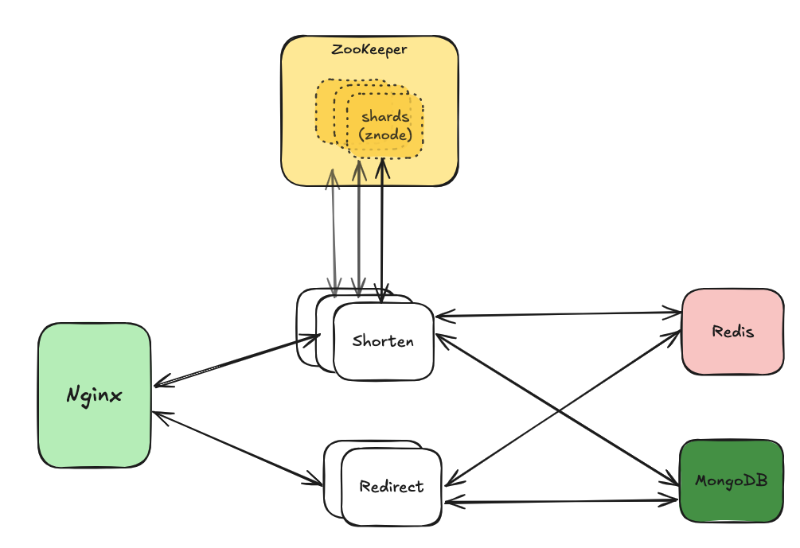
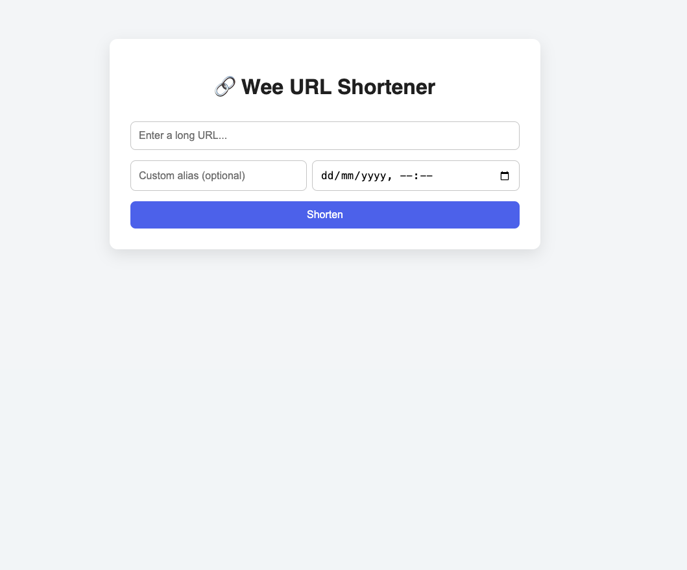
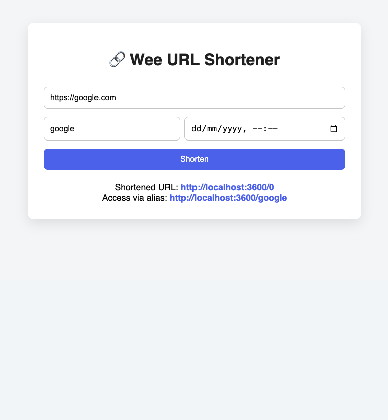

# wee - Rust URL Shortener

## Architecture


- **Nginx:**
    - Routes traffic to the appropriate service based on the URL.
    - Load balances between multiple instances of the shorten and redirect services.
- **Shorten Service:**
    - Receives a URL and parameters (e.g., custom alias, expiration date), requests an incremented ID from ZooKeeper, then encodes it to base62.
    - Stores the shortened URL and its metadata in MongoDB and Redis.
- **ZooKeeper:**
    - Used as a consistent sequencer thanks to its ZAB (ZooKeeper Atomic Broadcast) protocol.
    - The keyspace is divided into shards, and each shard (PersistentNode) is assigned to one or more shorten services. This enhances system scalability and throughput.
- **Redirect Service:**
    - Receives a shortened URL and redirects to the original URL with status code 302 (temporary redirect).
- **MongoDB:**
    - Stores the shortened URL and its metadata.
    - Easily scales horizontally.
- **Redis:**
    - Caches the shortened URL and its metadata.
    - Provides fast access to frequently used data.
## Run
For development, run the following command to start the services:
```bash
docker-compose -f docker-compose.dev.yaml up -d
```

For end to end testing, run the following command to start the services:
```bash
docker-compose build && docker-compose up -d
```
Access home page at [http://localhost:3600](http://localhost:3600).




## Testing
TBD

## License
This project is licensed under the Apache 2.0 License – see the [LICENSE](LICENSE) file for details.